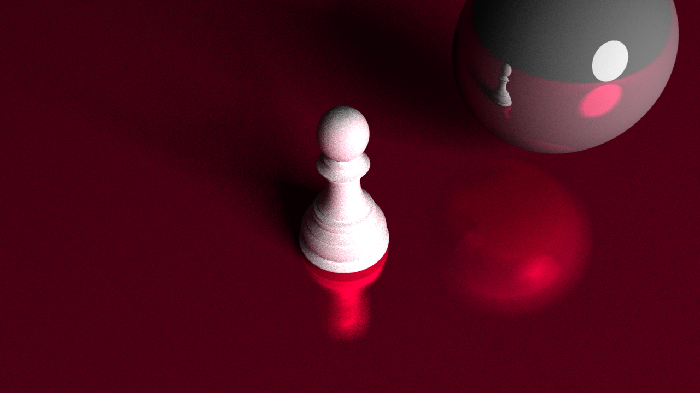
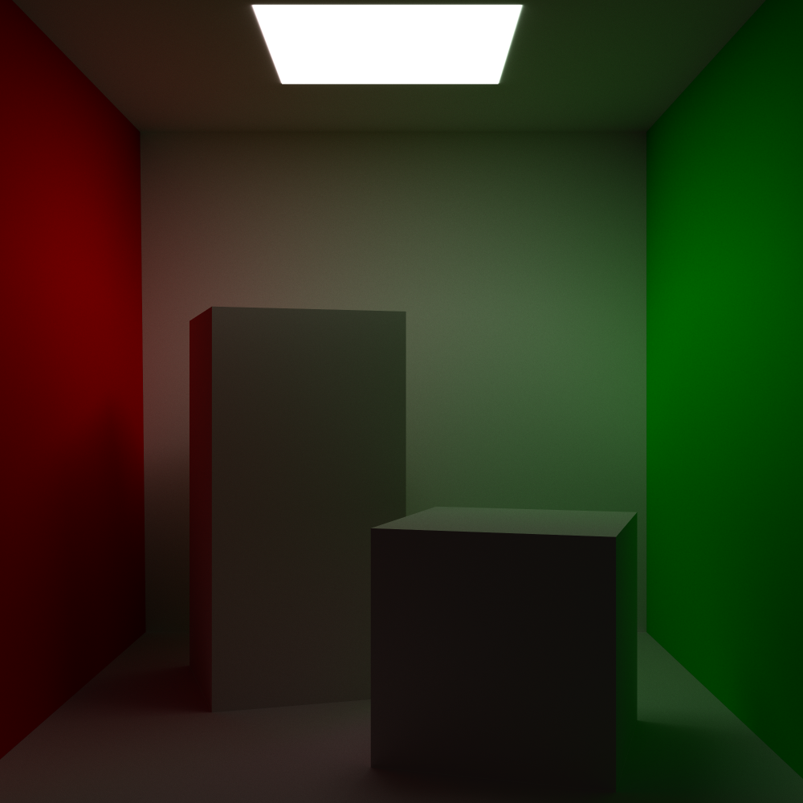
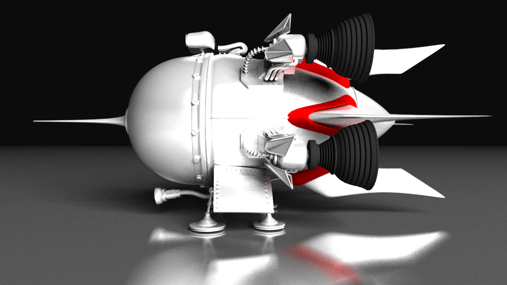

# LiSA Path Tracing Renderer

LiSA is a path tracing rendering engine developped in C++ using OpenGL 4.5.

LiSA runs in a GLSL compute shader and uses a simplified version of Monte-Carlo rendering technique.

## Build and usage

### Linux
You need GLFW and GLEW to compile this project.
````bash
sudo apt-get install libglfw3-dev
sudo apt-get install libglew-dev
cd build
make
./LiSA scene_file.rto nb_passes [output_file.ppm nb_sample=3]
````

### macOS
TODO

### Windows
TODO

## How it works
- The number of passes corresponds to the number of times LiSA will compute the color of each pixel to average it.
- The number of samples correponds to the number of times a ray can bounce.
- The output file is a [ppm](https://fr.wikipedia.org/wiki/Portable_pixmap) image.
- You have to provide a file describing the scene you want LiSA to render. You can find some examples in the folder ````assets````.

### Scene file example
````
Material whiteglossy {
    color = (1, 1, 1)
    roughness = 1
}

Material mirror{
    color = (0.5,0.5,0.5)
    roughness = 0
}

Material light {
    light = true
    color = (1, 1, 1)
    emit_intensity = 1
}

Sphere {
    center = (2, 1, 2.5)
    radius = 1
    material = light
}

Sphere {
    center = (0.3, 0.1, -0.2)
    radius = 0.15
    material = mirror
}


Mesh {
    obj_file = ../objs/pawn.obj
    material = whiteglossy
}


Camera {
    position = (0, 10, 5.5)
    look_at = (0, 10, 0)
}

output_width = 1280
output_heigth = 720
````

## Limitations
There are some limitations to LiSA, mostly cause of my lack of knowledge:
- Only a Sphere object can emit light.
- Only one light per scene.
- LiSA is slow and can crash the GPU driver if the number of vertices exceed 3M.


## Sample images
````assets/chess_pawn.rto```` 1000 passes 3 samples


````assets/cornell_box.rto```` 1000 passes 3 samples


````assets/spaceship.rto```` 50 passes 2 samples

model from https://benedikt-bitterli.me/resources/



## TODO list
- Optimize the computation time.
- Improve the rendering technique.
- Add transparency and refraction.

## Credits
- GLSL Path tracer (https://github.com/knightcrawler25/GLSL-PathTracer). An amazing renderer. I took a modfied version of the scene and a random() function in GLSL from here.
- Scratchpixel 2.0 (https://www.scratchapixel.com/) for their lessons about ray tracing, monte carlo, etc..
## License
[GNU v3](https://choosealicense.com/licenses/gpl-3.0/)
